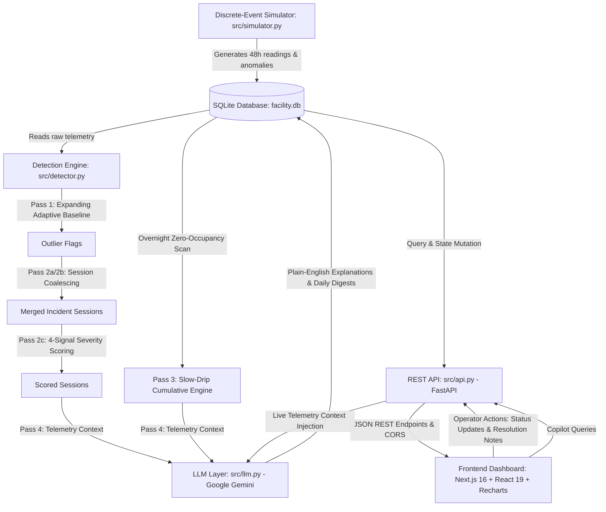

# KOHLER Smart Facility & Sustainability Manager (Track 2)
## Comprehensive Technical Project Summary & System Architecture Review

**Target Document:** System Architecture, Anomaly Detection Pipeline, Data Model, and Operational Specification  
**Project Path:** `c:\sem 5\kohler case study`  
**File Output:** `project_summary_for_review.md`  
**Author / Engine:** Independent Review Summary Specification  
**Current Date:** September 2026  

---

## 1. Project Overview

### 1.1 Problem Statement & Context
Commercial airport facilities face severe operational, sustainability, and maintenance challenges in high-traffic public restrooms. Plumbing fixtures (sensor faucets, dual-flush toilets, flushometer urinals) experience mechanical wear, diaphragm/valve seal deterioration, and solenoid malfunctions. Traditional facilities operate reactively: leaks persist unnoticed for hours or days until physical overflows occur or monthly utility bills expose massive water loss.

The **KOHLER Smart Facility & Sustainability Manager** addresses **Track 2 (Commercial Facility & Sustainability Operations)** by creating an intelligent, continuous telemetry monitoring and edge/cloud diagnostic system. Built around **Terminal 2 Restroom Block (Departure and Arrival concourses)**, the platform ingests high-frequency fixture-level sensor data, correlates flow dynamics with spatial occupancy, autonomously detects multi-class plumbing anomalies, scores their severity, calculates financial and environmental impact, and generates plain-English diagnostic explanations for maintenance personnel using Generative AI.

### 1.2 Core Problem Solved
1. **Divergent Anomaly Profiles:** Detecting both high-flow sudden leaks (e.g., stuck diaphragm valves) and microscopic slow drips (e.g., flapper seal decay at 0.25 L/min) that evade conventional static threshold detectors.
2. **False-Positive Elimination:** Preventing normal operational surges (e.g., high morning flight departure rush where sinks run continuously for 15 minutes while fully occupied) from triggering nuisance maintenance dispatch alerts.
3. **Operational Grounding with Generative AI:** Bridging the gap between raw numeric telemetry (LPM, variance, z-scores) and actionable facility work orders by auto-generating clear, context-aware incident summaries and end-of-day digests.
4. **End-to-End Workflow Management:** Moving seamlessly from anomaly detection to automated ticket generation, status tracking (`open` → `dispatched` → `resolved`), and resolution logging.

### 1.3 High-Level System Architecture
The platform comprises six discrete architectural layers:



1. **Discrete-Event Simulator (`src/simulator.py`):** Generates 48 hours of 1-minute interval telemetry for 16 commercial fixtures across 4 terminal zones using Poisson event sampling, airport flight traffic curves, and calibrated water fixture distributions.
2. **Persistence Store (`src/database.py`):** Single local SQLite database (`facility.db`) containing raw telemetry readings, anomaly tickets, and end-of-day operational digests.
3. **Deterministic Detection Pipeline (`src/detector.py`):** Multi-stage algorithmic pipeline combining hourly-stratified adaptive expanding baselines, temporal session coalescing, multi-signal correlation (flow + occupancy + duration + sensor health), and cumulative sliding-window integration.
4. **AI Reasoning & Explanation Layer (`src/llm.py`):** Interfaces with Google Gemini (`gemini-3.6-flash` / `gemini-2.5-flash`) to transform numeric anomalies into plain-English operational explanations and daily executive digests.
5. **Application Backend API (`src/api.py`):** High-performance asynchronous FastAPI REST backend providing downsampled telemetry, heatmap matrices, ticket life-cycle management, and AI copilot endpoints.
6. **Executive Web Frontend (`frontend/`):** Enterprise-grade Next.js 16 (App Router, Turbopack, Tailwind CSS v4) monitoring portal featuring interactive Recharts telemetry, a 16×24 occupancy heatmap matrix, a dedicated ticket triage queue, a 48-hour historical replay scrubber, and an AI facility copilot drawer.

---

## 2. Tech Stack

The technology stack is pulled directly from the active `requirements.txt` and `frontend/package.json`:

### 2.1 Backend Dependencies (`requirements.txt`)
- **Python Runtime:** Python 3.10+ (tested on Python 3.11 / 3.12, Windows x64)
- **`fastapi>=0.110.0`**: High-performance asynchronous REST API framework.
- **`uvicorn[standard]>=0.28.0`**: ASGI server for running the FastAPI application.
- **`pydantic>=2.0.0`**: Schema validation and request/response serialization.
- **`pandas>=2.0.0`**: High-performance vectorized time-series manipulation and SQL data framing.
- **`numpy>=1.26.0`**: Vectorized numerical operations, baseline statistics, and array math.
- **`python-dotenv>=1.0.0`**: Environment variable management (`.env` loading for API keys).
- **`google-generativeai>=0.8.0`**: Official Google SDK for Gemini Flash models.
- *(Note: Legacy prototyping tools like `streamlit` and `plotly` have been completely removed from runtime requirements).*

### 2.2 Database
- **Engine:** SQLite 3 (native Python standard library `sqlite3`).
- **File:** `facility.db` located at project root.
- **Access Pattern:** Dict-like row factories (`conn.row_factory = sqlite3.Row`) with thread-safe connection pooling (`check_same_thread=False`).

### 2.3 LLM Provider & Models
- **Provider:** Google AI Studio / Google Generative AI API.
- **Primary Model:** `gemini-3.6-flash` (low-latency, structured JSON output).
- **Fallback Model:** `gemini-2.5-flash` (auto-selected if primary encounters rate limits or service unavailability).
- **Format Enforcement:** `response_mime_type="application/json"`, temperature `0.2`.

### 2.4 Frontend Dependencies (`frontend/package.json`)
- **Core Framework:** `next@16.3.5` (Next.js App Router, React Server Components enabled).
- **UI Library:** `react@19.2.8` & `react-dom@19.2.8`.
- **Charting Engine:** `recharts@^3.10.1` (SVG-based reactive telemetry rendering).
- **Iconography:** `lucide-react@^1.47.0` (enterprise operational icons).
- **Styling:** `tailwindcss@^4` with `@tailwindcss/postcss@^4`.
- **CSS Helpers:** `clsx@^2.1.1` and `tailwind-merge@^3.7.0`.
- **Language / Tooling:** `typescript@^5`, `eslint@^9`, `eslint-config-next@16.3.5`.

---

## 3. Detection Logic in Full Detail

The anomaly detection engine in `src/detector.py` is entirely deterministic; the LLM never decides whether an event is an anomaly. The pipeline executes five distinct algorithmic passes:

```
Raw Telemetry (46,080 rows)
     │
     ▼
[Pass 1: compute_outlier_flags] ─── Hourly Expanding Baseline (μ + 2.5σ)
     │
     ▼
[Pass 2a: group_into_sessions] ─── Consecutive Outliers (gap ≤ 2 min)
     │
     ▼
[Pass 2b: span_unoccupied_sessions] ── Temporal Coalescing (gap ≤ 90 min, occ == 0)
     │
     ▼
[Pass 2c: score_session] ─── Multi-Signal Correlation & Severity Scoring (4 Signals)
     │                       (Suppresses noise < 10 min)
     │
     ├───────────────────────┐
     ▼                       ▼
Scored Sessions        [Pass 3: detect_slow_drip] ── Cumulative 120-min Scan (≥ 10 L)
     │                       │
     └───────────┬───────────┘
                 ▼
         Generated Tickets
                 │
                 ▼
[Pass 4: LLM Explanation Enrichment] ── Gemini JSON Generation (1-2 sentences)
                 │
                 ▼
[Pass 5: Daily Operational Digest] ── Low/Medium Ticket Rollup
```

### 3.1 Pass 1: Adaptive Baseline Calculation (`compute_outlier_flags`)
Rather than using static global limits, the system models each fixture independently stratified by hour of day:
- **Grouping:** `(fixture_id, hour_of_day)` where `hour_of_day ∈ [0, 23]`.
- **Expanding Window History:** Telemetry is processed in strict chronological order. Each fixture maintains 24 distinct arrays representing past observed flow values for that specific hour bucket.
- **Anti-Contamination Rule:** A sensor reading is evaluated against historical parameters *before* it is appended to the history:
  $$\text{history}_{h} = [x_1, x_2, \dots, x_{k-1}]$$
- **Baseline Formula:**
  $$\mu = \text{mean}(\text{history}_h)$$
  $$\sigma_{\text{eff}} = \max\left(\text{std}(\text{history}_h), \text{STD\_FLOOR}\right)$$
  $$\text{threshold} = \mu + \left(\text{BASELINE\_SIGMA} \times \sigma_{\text{eff}}\right)$$
- **Config Constants Used (`src/config.py`):**
  - `BASELINE_SIGMA = 2.5`: Flags readings that exceed $2.5$ standard deviations above the hour's moving average.
  - `MIN_BASELINE_SAMPLES = 5`: Requires at least 5 prior readings for that hour before flagging begins (prevents false alerts on initialization).
  - `STD_FLOOR = 0.2`: Imposes an absolute variance floor. Overnight hours often have true 0.0 LPM flow; without `STD_FLOOR`, $\sigma = 0$, causing any tiny noise to trigger an outlier. The floor establishes an effective overnight threshold of:
    $$\text{threshold}_{\text{overnight}} = 0.0 + 2.5 \times 0.2 = 0.50\text{ LPM}$$
- **Output:** Appends boolean `is_outlier`, `baseline_mean`, `baseline_std`, and `threshold` to the dataset.

### 3.2 Pass 2a & 2b: Multi-Signal Session Grouping & Temporal Coalescing
1. **Pass 2a (`group_into_sessions`):** Consecutive outlier readings for the same fixture with a temporal gap $\le 2\text{ minutes}$ (`max_gap_minutes = 2`) are clustered into micro-sessions.
2. **Pass 2b (`span_unoccupied_sessions`) — Solving Baseline Drift:**
   - *The Problem:* Because the expanding baseline adapts to ongoing flow within $\approx 10$ readings, a 4-hour continuous 3.5 LPM leak generates $\approx 10$ outlier readings at the start of each hour, followed by adaptation as the mean drifts up. This naturally fragments a single 4-hour leak into 4 separate 10-minute bursts.
   - *The Solution (Production Incident Coalescer):* The engine inspects consecutive micro-sessions for the same fixture. If **both** sessions have 100% zero occupancy (`occ_mismatch == 1.0`) and are separated by $\le 90\text{ minutes}$ (`max_span_gap_minutes = 90`), they are merged into a single continuous incident session spanning the entire duration. Daytime occupied sessions are preserved as separate events because presence breaks the merge chain.

### 3.3 Pass 2c: Multi-Signal Correlation & Severity Scoring (`score_session`)
Each candidate session is evaluated through multi-signal correlation:
1. **Noise Suppression:**
   $$\text{duration\_minutes} < \text{MIN\_SESSION_DURATION_MINUTES (10 min)} \implies \text{SUPPRESSED (None)}$$
   This completely suppresses normal high-flow toilet flushes (which last 10–60 seconds, representing 1 row in 1-minute sampling) and temporary user spikes.
2. **Signal Normalization:**
   - **Flow Deviation:** $\Delta_{\text{flow}} = \max(\text{avg\_flow\_lpm} - \text{avg\_baseline\_mean}, 0.0)$
     $$\text{flow\_dev\_norm} = \min\left(\frac{\Delta_{\text{flow}}}{\text{FLOW\_DEV\_CAP\_LPM}}, 1.0\right) \quad (\text{FLOW\_DEV\_CAP\_LPM} = 10.0\text{ LPM})$$
   - **Duration:**
     $$\text{duration\_norm} = \min\left(\frac{\text{duration\_minutes}}{\text{DURATION\_CAP\_MIN}}, 1.0\right) \quad (\text{DURATION\_CAP\_MIN} = 60.0\text{ min})$$
   - **Occupancy Mismatch:**
     $$\text{occ\_mismatch} = \begin{cases} 1.0 & \text{if all readings have occupancy} = 0 \\ 0.0 & \text{otherwise} \end{cases}$$
   - **Sensor Health Penalty:**
     $$\text{sensor\_penalty} = \begin{cases} 1.0 & \text{if any reading has sensor\_status} \in \{\text{"FAULT"}, \text{"OFFLINE"}\} \\ 0.0 & \text{otherwise} \end{cases}$$
3. **Severity Formula & Weights:**
   $$\text{raw\_score} = \left(\text{flow\_dev\_norm} \times 0.40 + \text{duration\_norm} \times 0.30 + \text{occ\_mismatch} \times 0.20 + \text{sensor\_penalty} \times 0.10\right) \times 100$$
   $$\text{severity\_score} = \text{round}(\text{raw\_score}, 1)$$
   - *Weight Distribution:*
     - `W_FLOW_DEV = 0.40`: Primary magnitude indicator.
     - `W_DURATION = 0.30`: Persistent waste indicator.
     - `W_OCC_MISMATCH = 0.20`: Critical discriminator (flow with no human present indicates plumbing failure).
     - `W_SENSOR_HEALTH = 0.10`: Diagnostic confidence factor.
4. **Severity Tier Mapping:**
   - $\ge 76$: **Critical** (`SEVERITY_CRITICAL_THRESHOLD = 76`)
   - $\ge 51$: **High** (`SEVERITY_HIGH_THRESHOLD = 51`)
   - $\ge 26$: **Medium** (`SEVERITY_MEDIUM_THRESHOLD = 26`)
   - $< 26$: **Low**
5. **Deterministic Anomaly Typing:**
   - If `sensor_penalty == 1.0` $\implies$ `"sensor_fault"`
   - Else if `occ_mismatch == 1.0` $\implies$ `"sustained_leak"`
   - Else $\implies$ `"hygiene_threshold"`

### 3.4 Pass 3: Slow-Drip Cumulative Detection (`detect_slow_drip`)
Standard $Z$-score/sigma detectors cannot catch slow drips (e.g. 0.25 LPM) because 0.25 LPM is below the 0.50 LPM overnight $\mu + 2.5\sigma$ threshold. Pass 3 uses cumulative window integration:
1. **Filter:** Telemetry filtered to hours where $\text{hour} \in [22, 6)$ (`SLOW_DRIP_OVERNIGHT_HOURS = (22, 6)`) and `occupancy == 0`.
2. **Rolling Integration:** For each fixture, slides a 120-minute window (`SLOW_DRIP_WINDOW_MINUTES = 120`):
   $$\text{cumulative\_flow} = \sum_{t \in W} \text{flow\_rate\_lpm}_t$$
3. **Trigger:** If $\text{cumulative\_flow} \ge 10.0\text{ Litres}$ (`SLOW_DRIP_CUMULATIVE_THRESHOLD_L = 10.0`) across at least 30 valid readings (`SLOW_DRIP_MIN_READINGS = 30`):
   - A normal fixture sums $\approx 0.0\text{ L}$.
   - A 0.25 LPM drip sums: $0.25 \times 120 = 30.0\text{ L} \gg 10.0\text{ L}$.
   - Emits a ticket with `anomaly_type = "slow_drip"`.
4. **De-duplication:** Window advances to avoid redundant triggers on the same event.

### 3.5 Water Loss & Financial Impact Calculations (`session_to_ticket`)
For every emitted ticket:
$$\text{estimated\_water\_loss\_liters} = \text{round}(\text{avg\_flow\_lpm} \times \text{duration\_minutes}, 2)$$
$$\text{estimated\_cost\_impact (INR ₹)} = \text{round}(\text{estimated\_water\_loss\_liters} \times \text{WATER\_COST\_PER\_LITER}, 2)$$
- `WATER_COST_PER_LITER = 0.05` (₹0.05 per Litre = ₹50 per 1,000 Litres, benchmarked to Indian commercial utility tariffs: BWSSB Bangalore / MCGM Mumbai).
- **Ticket ID Format:** `f"TKT-{fixture_id}-{YYYYMMDDHHMM}"` (e.g., `TKT-Sink_01-202401160200`).

---

## 4. Data Model

The SQLite database (`facility.db`) schema is defined and initialized in `src/database.py`.

### 4.1 Table: `sensor_readings`
Stores continuous raw 1-minute time-series telemetry for all monitored fixtures.

| Field Name | SQLite Type | Nullable | Default | Description |
| :--- | :--- | :--- | :--- | :--- |
| `id` | `INTEGER` | No | Auto-increment | Primary key. |
| `timestamp` | `TEXT` | No | None | ISO 8601 string (`YYYY-MM-DDTHH:MM:SS`). |
| `zone_id` | `TEXT` | No | None | Zone identifier (e.g., `T2_Restroom_A`). |
| `fixture_id` | `TEXT` | No | None | Unique fixture tag (e.g., `Sink_01`, `Toilet_B1`). |
| `flow_rate_lpm` | `REAL` | No | None | Water volume delivered in that 1-min slot (L/min). |
| `occupancy` | `INTEGER` | No | None | Binary presence flag (`1` = occupied, `0` = vacant). |
| `flush_count_cumulative` | `INTEGER` | No | None | Monotonically increasing flush/activation counter. |
| `sensor_status` | `TEXT` | No | `'OK'` | Diagnostic state (`'OK'`, `'FAULT'`, `'OFFLINE'`). |

- **Index:** `CREATE INDEX IF NOT EXISTS idx_readings_fixture_ts ON sensor_readings (fixture_id, timestamp)`

### 4.2 Table: `tickets`
Stores flagged operational incidents, AI explanations, status lifecycles, and technician resolution audit notes.

| Field Name | SQLite Type | Nullable | Default | Description |
| :--- | :--- | :--- | :--- | :--- |
| `ticket_id` | `TEXT` | No | Primary Key | Formatted ID (`TKT-<fixture>-<timestamp>`). |
| `timestamp_flagged` | `TEXT` | No | None | Start timestamp of detected anomaly window. |
| `zone_id` | `TEXT` | No | None | Zone identifier. |
| `fixture_id` | `TEXT` | No | None | Fixture identifier. |
| `anomaly_type` | `TEXT` | No | None | Category: `sustained_leak`, `slow_drip`, `sensor_fault`, `hygiene_threshold`. |
| `severity_score` | `REAL` | Yes | `NULL` | Normalized composite score ($0.0 - 100.0$). |
| `severity_label` | `TEXT` | No | `'Flagged'` | Categorical tier (`Critical`, `High`, `Medium`, `Low`). |
| `explanation` | `TEXT` | No | `''` | 1-2 sentence plain-English LLM or fallback explanation. |
| `estimated_water_loss_liters` | `REAL` | Yes | `NULL` | Cumulative water wasted ($L$). |
| `estimated_cost_impact` | `REAL` | Yes | `NULL` | Commercial financial impact in INR (₹). |
| `status` | `TEXT` | No | `'open'` | Lifecycle state: `'open'`, `'dispatched'`, `'resolved'`. |
| `resolution_note` | `TEXT` | No | `''` | Free-text maintenance log recorded when resolved. |

- **Automatic Migration:** `init_db()` inspects `PRAGMA table_info(tickets)` and executes `ALTER TABLE tickets ADD COLUMN resolution_note TEXT NOT NULL DEFAULT ''` if absent.

### 4.3 Table: `daily_digests`
Stores end-of-day natural language summaries for non-critical routine tickets.

| Field Name | SQLite Type | Nullable | Default | Description |
| :--- | :--- | :--- | :--- | :--- |
| `date` | `TEXT` | No | Primary Key | Date string (`YYYY-MM-DD`). |
| `digest` | `TEXT` | No | None | Executive summary generated by Gemini / fallback. |
| `ticket_count` | `INTEGER` | No | `0` | Number of Low/Medium tickets summarized. |
| `created_at` | `TEXT` | No | None | ISO 8601 generation timestamp. |

---

## 5. LLM Integration

The generative intelligence layer is located in `src/llm.py` and exposed interactively via `src/api.py`.

### 5.1 Architecture & Core Principles
1. **Pure Explanation (Separation of Concerns):** The LLM never acts as a classifier or anomaly detector. All tickets are generated deterministically by `detector.py`. The LLM generates human-readable explanations and operational digests based on verified numeric telemetry.
2. **One-Time Batch Generation:** Explanations are generated once during the detection run and persisted directly into SQLite (`tickets.explanation`). The frontend serves these cached strings with zero runtime LLM latency.
3. **Structured JSON Output:** Requests use `generation_config={"response_mime_type": "application/json", "temperature": 0.2}` to ensure 100% parseable output.
4. **Rate Limit Pacing & Retries:**
   - Free-tier rate limits (15 RPM) are respected by injecting `LLM_REQUEST_DELAY_SECONDS = 0.6` between consecutive API calls.
   - All network calls implement a retry loop (`LLM_MAX_RETRIES = 1`, `LLM_RETRY_BACKOFF_SECONDS = 2.0`).
5. **100% Graceful Deterministic Fallback:** If `GEMINI_API_KEY` is missing, network is offline, or API quota is exceeded, the system automatically uses deterministic rule-based explanations. The application never crashes or leaves empty fields.

### 5.2 End-to-End Explanation Generation Flow
1. **Trigger:** `run_detection()` in `detector.py` invokes `enrich_tickets_with_explanations(tickets)`.
2. **Prompt Construction:** Injects exact telemetry values:
   ```text
   TICKET DATA:
   - Fixture: Sink_01
   - Zone: T2_Restroom_A
   - Anomaly Type: sustained_leak
   - Severity: High (Score: 73.5/100)
   - Start Time: 2024-01-16T02:00:00
   - Duration: 39 minutes
   - Measured Flow: avg 3.50 LPM, peak 3.58 LPM
   - Baseline Expected Flow: 0.00 LPM
   - Occupancy: 0 (unoccupied throughout duration)
   - Estimated Water Loss: 136.5 Litres (Cost Impact: Rs. 6.82)
   ```
3. **Model Execution:** Evaluates prompt against `gemini-3.6-flash` (or fallback `gemini-2.5-flash`).
4. **Parsing:** Parses `{"explanation": "..."}` and stores in SQLite.
5. **Sample Output Generated:**
   > *"Flagged as High: Sink_01 in T2_Restroom_A showed sustained flow of 3.50 LPM for 39 minutes with zero occupancy detected — consistent with an active plumbing leak."*

### 5.3 Daily Operational Digest (`generate_daily_digest`)
- Summarizes routine **Low** and **Medium** tickets for each simulation day (`YYYY-MM-DD`), filtering out Critical/High incidents that require immediate dispatch.
- Prompts Gemini to synthesize total water loss, affected fixtures, and recommended non-urgent end-of-shift actions into a concise 2–3 sentence executive briefing stored in `daily_digests`.

### 5.4 AI Facility Copilot Chat (`/api/chat`)
- In `src/api.py`, an interactive chat endpoint allows operators to query system state.
- Injects a live markdown summary of current open tickets, worst offenders, and cumulative water loss as system context into Gemini, returning concise, formatted responses.

---

## 6. Features Built

### 6.1 Operations Dashboard
- **Brand Header:** KOHLER Smart Facility brand bar displaying Terminal 2 operations, dynamic live telemetry status badge, open ticket badge counter, view mode switchers, and AI Copilot trigger.
- **Four Top-Level Metric Cards:**
  1. *Sensor Readings Count:* Total 1-minute records monitored across the 48-hour window (46,080 readings).
  2. *Flagged Tickets:* Active open/dispatched incident count with severity warning icon.
  3. *Water Waste Volume:* Cumulative estimated water loss ($L$) across all anomalies.
  4. *Utility Cost Impact:* Municipal tariff financial loss in INR (₹).
- **Flow Rate Telemetry Chart (Recharts):**
  - Continuous 48-hour time-series with clean curves (`dot={false}`).
  - **Dual Mode Toggle:**
    - *Zone Totals:* Aggregated flow rate per zone.
    - *Per Fixture Breakdown:* Individual lines per fixture with fixture-type dash styling (solid lines for sinks, `4 4` dashed for toilets, `2 2` dotted for urinals).
  - **Zone Filter Chips:** Interactive toggle buttons with color dots matching the chart line palette (`T2_Restroom_A`: `#6B8CAE`, `T2_Restroom_B`: `#789A8B`, `T2_Family_Room`: `#B08D57`, `T2_Staff_WC`: `#847E9C`).
  - **Interactive Tooltip:** Displays precise timestamp and flow rates in L/min.
- **24-Hour Occupancy Heatmap Matrix:**
  - 16 Fixtures (y-axis) $\times$ 24 Hours of Day (x-axis) grid.
  - Color intensity corresponds to average passenger occupancy density, highlighting morning (07:00–09:00) and evening (17:00–19:00) departure rushes.
  - Hover tooltips show fixture ID, hour, and average occupancy percentage.
- **Daily Operational Digest Card:**
  - Date tab selector for simulation days.
  - Displays natural-language executive briefings for Low/Medium routine maintenance items.
- **Dashboard Tickets Preview Table:**
  - Compact triage table showing recent tickets with severity badges, timestamps, water volume, and inline status dropdowns.

### 6.2 Dedicated Tickets Management Tab (`TicketsView`)
- **Partitioned Incident Layout:**
  - **Active Tickets Queue:** Displays all tickets with status `open` or `dispatched`. Automatically sorted by **Severity Rank First** (`Critical` $\to$ `High` $\to$ `Medium` $\to$ `Low`), and secondarily by most recently flagged (`timestamp_flagged DESC`).
  - **Resolved Tickets Audit Section:** Collapsible historical archive of closed tickets, keeping the primary workspace focused on unresolved incidents.
- **Status Lifecycle Control:**
  - Direct transitions: `Open` $\to$ `Dispatched` $\to$ `Resolved`.
  - Optimistic UI updates with instant SQLite persistence via `PATCH /api/tickets/{id}/status`.
- **Resolution Modal & Audit Notes:**
  - Triggered when marking any ticket as `Resolved`.
  - Includes **Quick-Select Resolution Presets**:
    - *"Valve replaced"*
    - *"False alarm — sensor recalibrated"*
    - *"Supply fitting tightened"*
    - *"Flapper seal cleaned and tested"*
  - Free-text textarea for custom technician notes, saved to `tickets.resolution_note`.
- **Multi-Faceted Triage Filters:**
  - Filter by Zone (`All Zones`, `Restroom A`, `Restroom B`, `Family Room`, `Staff WC`).
  - Filter by Anomaly Type (`All Types`, `Sustained Leak`, `Slow Drip`, `Sensor Fault`, `Hygiene Threshold`).

### 6.3 Replay Demo Mode (`ReplayScrubber`)
- Allows evaluators to scrub through the 48-hour dataset or play it back continuously.
- **Interactive Controls:** Scrub bar (Hour 0 to 48), Play/Pause toggle, Reset button, and current simulation timestamp display.
- **Dynamic Chart Slicing:** As the scrubber advances, the flow telemetry line chart dynamically streams data up to the scrubber timestamp, metric cards update cumulatively, and tickets appear at the exact moment they were flagged.

### 6.4 AI Facility Copilot Drawer (`AiCopilotDrawer`)
- Slide-out chat assistant accessible via the header sparkle button.
- Grounded with live database context (current open tickets, water loss, high-severity alerts).
- Includes one-click quick prompts (*"Which fixture has the worst water waste right now?"*, *"Summarize overnight leaks in Restroom A"*, *"What is the total utility cost impact?"*).

---

## 7. Known Limitations & Unresolved Issues

In the spirit of a transparent technical audit, the following items represent deliberate design tradeoffs, known limitations, or edge cases:

1. **Static 48-Hour Simulation Window:**
   - The platform operates on a pre-generated 48-hour simulation window (`2024-01-15 00:00:00` to `2024-01-17 00:00:00`) stored in SQLite. It does not connect to a real-time MQTT/Kafka streaming broker, though the FastAPI architecture and database layer are designed to ingest streaming readings if connected.
2. **Gemini Free-Tier Rate-Limit Pacing:**
   - Due to the 15 Requests-Per-Minute (RPM) limit on free Google AI Studio keys, ticket explanation enrichment uses a sequential `0.6s` delay between items. For dozens of tickets, initial generation takes 15–30 seconds. In production, an enterprise Vertex AI endpoint with batch inference would be used.
3. **Legend Double-Click Isolate Deprioritization:**
   - In Recharts, native SVG legend double-click event capture for isolating individual series was fragile across browser engines and created layout jitter. This was deprioritized in favor of top-level **Zone Filter Chips** that cleanly toggle zones in and out of the chart.
4. **Client-Side Data Downsampling (5-Minute Buckets):**
   - The `/api/readings` endpoint downsamples 46,080 raw 1-minute rows to 5-minute intervals (`downsample_mins=5`, $\approx 576$ points per fixture) for web chart rendering. While this keeps browser DOM memory low and interactions fast, sharp 1-minute single-reading spikes can be smoothed out in the full 48-hour overview (though they remain fully evaluated by the backend detector).
5. **Discrete Binary Occupancy Sensing:**
   - The occupancy sensor is modeled as a binary flag (`0` or `1`) per fixture stall. Real-world facilities sometimes utilize continuous ToF (Time-of-Flight) optical sensors or radar people-counters that output confidence scores or dwell times.

---

## 8. How to Run It

Follow these step-by-step instructions to run the application from a fresh clone.

### 8.1 Prerequisites
- **Python:** 3.10, 3.11, or 3.12 installed (`python --version`).
- **Node.js:** v18.0.0 or higher (v20+ recommended, `node -v`).
- **npm:** v9.0.0 or higher (`npm -v`).
- **Google Gemini API Key (Optional but recommended):** Obtain a key from [Google AI Studio](https://aistudio.google.com/). If omitted, the platform automatically uses its deterministic fallback explanations.

---

### 8.2 Backend Setup & Execution

1. **Open a terminal in the project root directory:**
   ```bash
   cd "c:\sem 5\kohler case study"
   ```

2. **Create and activate a Python virtual environment:**
   ```bash
   # Windows PowerShell:
   python -m venv venv
   .\venv\Scripts\Activate.ps1

   # Windows Command Prompt:
   python -m venv venv
   .\venv\Scripts\activate.bat

   # Linux/macOS:
   python3 -m venv venv
   source venv/bin/activate
   ```

3. **Install backend dependencies:**
   ```bash
   pip install -r requirements.txt
   ```

4. **Configure Environment Variables (Optional):**
   Create a `.env` file in the project root:
   ```env
   GEMINI_API_KEY=your_actual_gemini_api_key_here
   ```

5. **Generate the 48-hour simulation dataset:**
   ```bash
   python src/simulator.py
   ```
   *Output:* Creates `facility.db` at the project root and populates `sensor_readings` with 46,080 records.

6. **Run the multi-pass anomaly detection engine & LLM enrichment:**
   ```bash
   python src/detector.py
   ```
   *Output:* Executes Passes 1–5, populates `tickets` with scored anomalies and LLM explanations, and writes `daily_digests`.

7. **Start the FastAPI REST backend server:**
   ```bash
   uvicorn src.api:app --reload --port 8000
   ```
   *Verification:* Open `http://localhost:8000/api/health` in your browser. It should return `{"status": "healthy", "db_exists": true}`.

---

### 8.3 Frontend Setup & Execution

1. **Open a second terminal and navigate to the frontend directory:**
   ```bash
   cd "c:\sem 5\kohler case study\frontend"
   ```

2. **Install Node.js dependencies:**
   ```bash
   npm install
   ```

3. **Start the Next.js development server:**
   ```bash
   npm run dev
   ```

4. **Access the Application:**
   Open your browser to:
   ```text
   http://localhost:3000
   ```

---

### 8.4 Verification Checklist
- [x] **KPI Cards:** All 4 metric cards load real numbers (Readings $\approx 46,080$, Flagged Tickets $> 0$, Water Loss in Litres, Cost in INR ₹).
- [x] **Telemetry Chart:** Flow curves render cleanly across the 48-hour timeline with zone toggles working.
- [x] **Heatmap:** 16-fixture occupancy matrix displays diurnal morning/evening rush patterns.
- [x] **Tickets Tab:** Clicking "Tickets Queue" displays active tickets sorted by severity (Critical $\to$ High $\to$ Medium $\to$ Low).
- [x] **Status Update:** Changing a ticket to `Resolved` opens the resolution modal, accepts a quick-note, and moves the ticket to the Resolved section.
- [x] **Copilot:** Clicking the sparkles icon opens the drawer; submitting a prompt returns a context-grounded response.
- [x] **Replay Scrubber:** Switching to "Replay Scrubber" allows timeline scrubbing and animated playback.
